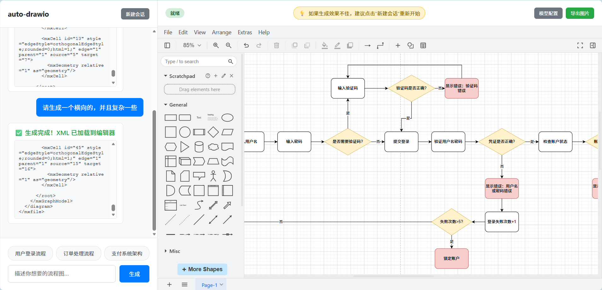
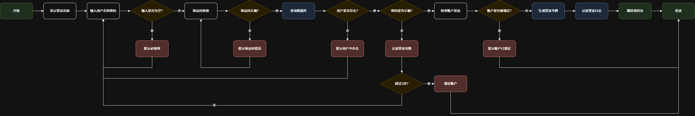

# Auto-Drawio

<div align="center">

**🎨 AI 驱动的智能流程图生成器**

一个基于 AI 的自动化流程图生成工具，支持通过自然语言描述快速创建专业的 Draw.io 流程图。

[功能特性](#-功能特性) • [快速开始](#-快速开始) • [部署指南](#-部署指南) • [使用说明](#-使用说明) • [常见问题](#-常见问题)

</div>

---

## 📖 项目简介

Auto-Drawio 是一个创新的流程图生成工具，它结合了大语言模型的理解能力和 Draw.io 的强大绘图功能。用户只需用自然语言描述想要的流程图，AI 就会自动生成专业的可编辑流程图。

### ✨ 功能特性

- 🤖 **AI 智能生成**：通过自然语言描述，自动生成专业流程图
- 🔄 **流式输出**：实时显示 XML 生成过程，即时预览代码
- ✏️ **在线编辑**：集成 Draw.io 编辑器，支持自由编辑和调整
- 💾 **多格式导出**：支持导出为 PNG、JPG、SVG 三种格式
- 🎯 **快捷提问**：预设常用场景，一键快速生成
- 🔧 **灵活配置**：支持多个 AI 模型配置，自由切换
- 💬 **对话记忆**：支持上下文对话，可基于现有流程图持续优化
- 🔄 **新建会话**：一键清空历史，重新开始


<div align="center">

</div>

<div align="center">

</div>

## 🚀 快速开始

### 前置要求

确保您的系统已安装：

- **Python 3.8+**

### 一分钟快速启动

```bash
# 1. 克隆项目
git clone https://github.com/ZhangQL2824/auto-drawio.git
cd auto-drawio

# 2. 配置并启动后端
cd backend
pip install -r requirements.txt
cp .env.example .env
# 编辑 .env 文件填入 API 配置（可选，也可在前端配置）
python main.py

# 3. 打开前端
# 双击 index.html 或用浏览器打开
```

---

## 📦 部署指南

### 1. 配置后端

```bash
# 进入后端目录
cd backend

# 安装依赖
pip install -r requirements.txt

# 创建配置文件
cp .env.example .env
```

编辑 `.env` 文件（可选，也可以在前端界面配置）：

```env
# 默认 AI API 配置
DEFAULT_AI_NAME=Claude Sonnet 4.5
DEFAULT_AI_BASE_URL=https://api.anthropic.com/v1
DEFAULT_AI_API_KEY=your-api-key-here
DEFAULT_AI_MODEL=claude-sonnet-4-5-20250929

# 服务器配置
SERVER_HOST=0.0.0.0
SERVER_PORT=8000
```

### 2. 启动后端服务

```bash
# 在 backend 目录下
python main.py

# 或使用 uvicorn（推荐开发模式）
uvicorn main:app --reload --host 0.0.0.0 --port 8000
```

后端服务将在 `http://localhost:8000` 启动。

### 3. 访问前端

前端是纯静态页面，通过以下任一方式访问：

#### 直接打开

```bash
# 双击 index.html 或用浏览器打开
start index.html  # Windows
open index.html   # Mac
xdg-open index.html  # Linux
```

#### 使用 HTTP 服务器

```bash
# Python
python -m http.server 3000

# Node.js
npx serve .

# 访问 http://localhost:3000
```

---

## 🔧 配置 AI 模型

### 方式一：通过前端界面配置（推荐）

1. 启动应用后，点击右上角 **"模型配置"** 按钮
2. 点击 **"+ 添加新配置"**
3. 填写配置信息：
   - **配置名称**：例如 "OpenAI GPT-4"
   - **API 基础 URL**：例如 `https://api.openai.com/v1`
   - **API 密钥**：您的 API Key
   - **模型名称**：例如 `gpt-4`
4. 点击 **"保存"**
5. 点击 **"启用"** 按钮激活该配置（只能启用一个）

### 方式二：通过 .env 文件配置

编辑 `backend/.env`：

```env
DEFAULT_AI_NAME=OpenAI GPT-4
DEFAULT_AI_BASE_URL=https://api.openai.com/v1
DEFAULT_AI_API_KEY=sk-your-api-key-here
DEFAULT_AI_MODEL=gpt-4
```

### 支持的 AI 模型

理论上支持任何兼容 OpenAI API 格式的大语言模型：

- **OpenAI**：GPT-4, GPT-3.5
- **Anthropic**：Claude Sonnet, Claude Opus
- **国内大模型**：
  - 通义千问（阿里云）
  - 文心一言（百度）
  - 智谱 GLM（智谱 AI）
  - DeepSeek
- **本地模型**：Ollama, LocalAI 等

---

## 📝 使用说明

### 基本使用流程

1. **描述需求**：在左侧输入框输入流程图描述

   ```
   示例：
   - "生成一个用户登录流程图"
   - "创建一个电商订单处理流程"
   - "设计一个支付系统架构图"
   ```

2. **生成流程图**
   - 点击 **"生成"** 按钮
   - 或点击底部的 **快捷提问按钮**

3. **实时查看**
   - 左侧聊天区显示流式输出的 XML 代码
   - 生成完成后，右侧自动加载流程图

4. **编辑调整**
   - 在右侧 Draw.io 编辑器中自由编辑
   - 拖拽节点、修改文本、调整样式

5. **导出保存**
   - 点击右上角 **"导出图片"** 按钮
   - 选择格式：PNG / JPG / SVG
   - 自动下载到本地

### 快捷提问

点击底部快捷按钮，一键生成：
- **用户登录流程**
- **订单处理流程**
- **支付系统架构**

### 持续优化

支持基于当前流程图的持续对话：

```
- "把登录框加大一点"
- "添加一个忘记密码的分支"
- "将支付成功后的流程补充完整"
```

### 新建会话

如果生成效果不佳，点击左上角 **"新建会话"** 按钮，清空对话历史后重新开始。

💡 **提示**：右侧顶部有温馨提示："如果生成效果不佳，建议点击'新建会话'重新开始"

---

## 📂 项目结构

```
auto-drawio/
├── index.html              # 前端主页面（单页应用）
├── backend/                # 后端目录
│   ├── main.py            # FastAPI 主程序
│   ├── requirements.txt   # Python 依赖
│   ├── .env.example       # 环境变量示例
│   └── .env              # 环境变量配置（需自行创建）
├── README.md              # 项目文档
└── .gitignore            # Git 忽略文件
```

---

## ❓ 常见问题

### 1. Draw.io 编辑器无法加载

**问题**：右侧编辑器显示空白

**解决方案**：
- ✅ 检查浏览器控制台是否有错误
- ✅ 尝试清除浏览器缓存后刷新
- ✅ 更换浏览器（推荐 Chrome/Edge）

### 2. 生成失败或效果差

**问题**：AI 无法生成或生成的流程图不理想

**解决方案**：
- ✅ 检查 AI API 配置是否正确
- ✅ 确认 API Key 有效且有额度
- ✅ 点击 **"新建会话"** 清空历史
- ✅ 使用更详细的描述
- ✅ 切换到其他 AI 模型

### 3. 前端无法连接后端

**问题**：生成时提示网络错误

**解决方案**：
- ✅ 确认后端服务已启动（`http://localhost:8000`）
- ✅ 检查防火墙是否阻止 8000 端口
- ✅ 访问 `http://localhost:8000/docs` 测试后端 API

### 4. 导出图片失败

**问题**：点击导出图片无反应

**解决方案**：
- ✅ 确保已生成流程图
- ✅ 检查浏览器控制台错误
- ✅ 更换浏览器（推荐 Chrome/Edge）

---

## 🌐 关于 Draw.io 集成

本项目已内置 Draw.io 编辑器，无需安装 Docker 或任何额外软件。

**优点**：
- ✅ 零配置，开箱即用
- ✅ 完全离线可用，无需网络连接
- ✅ 快速加载，无外部依赖

---

## 📄 许可证

本项目采用 MIT 许可证。详见 [LICENSE](LICENSE) 文件。

**第三方组件：**
- Draw.io - Apache v2 许可证
- FastAPI - MIT 许可证

---

## 🙏 致谢

- [Draw.io](https://github.com/jgraph/drawio) - 强大的开源绘图工具
- [FastAPI](https://fastapi.tiangolo.com/) - 现代化的 Python Web 框架
- 所有贡献者和使用者 ❤️

---

## 📧 联系方式

- 微信联系：扫描下方二维码添加微信好友（昵称：在逃淀粉肠）

<div align="center">

</div>

---

<div align="center">

**⭐ 如果这个项目对您有帮助，请给我们一个 Star！**

Made with ❤️ by 在逃淀粉肠

[⬆ 返回顶部](#auto-drawio)

</div>

